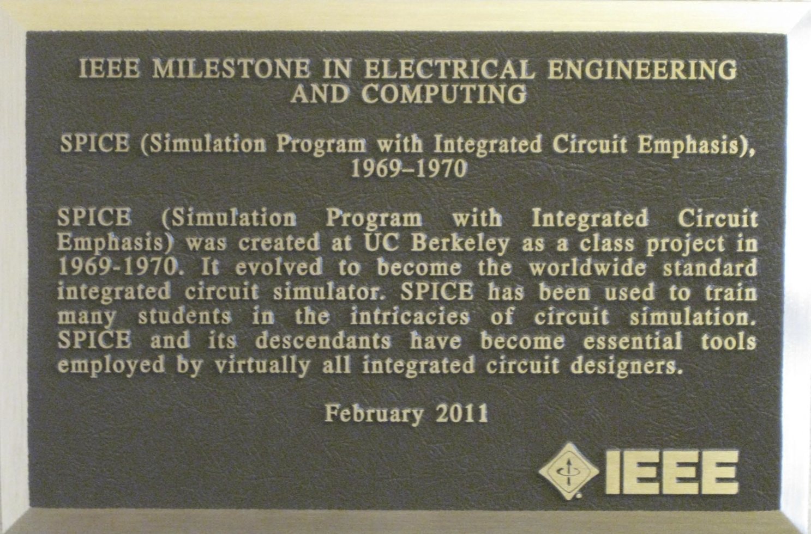

# Chris's Corner Spice Simulations

This repository holds SPICE simulations associated with Chris Lott's
articles on the Novacentrix blog. Unless a separate monster SPICE
simulation is needed for some reasone, all simulations will be kept in
different directories within this repository, using a common symbol and
SPICE model library.

### Notes

1. Photo of the IEEE Milestone in Electrical Engineering and Computing
   plaque installed in the main entrance to Cory Hall, the Electrical
   Engineering building on the UC Berkeley campus where SPICE was
   developed, as shown in [this presentation](https://www.mos-ak.org/bucharest/presetnations/Nagel_SPICE_In_The_Twenty-First_Century.pdf)
   given by Dr Laurence Nagel in Bucharest, Romania, Sep 2013.

